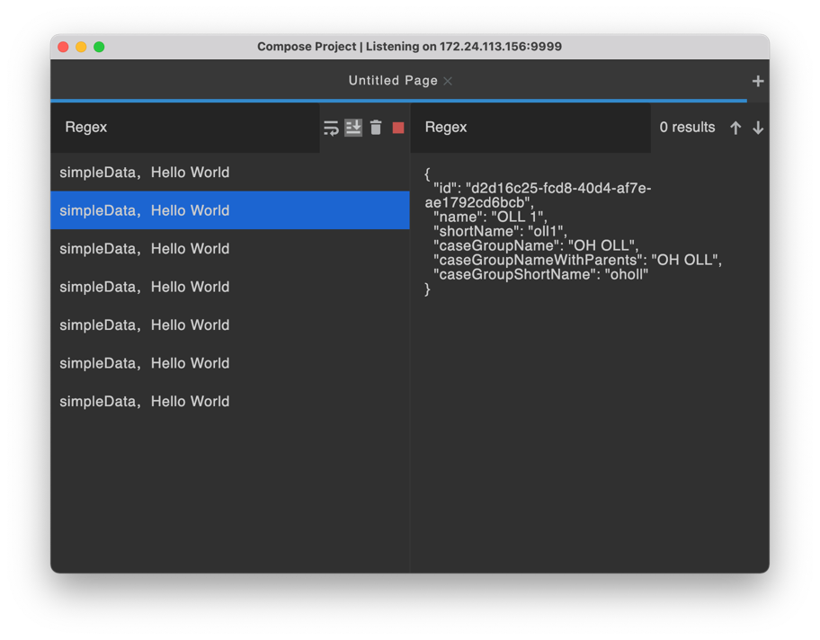
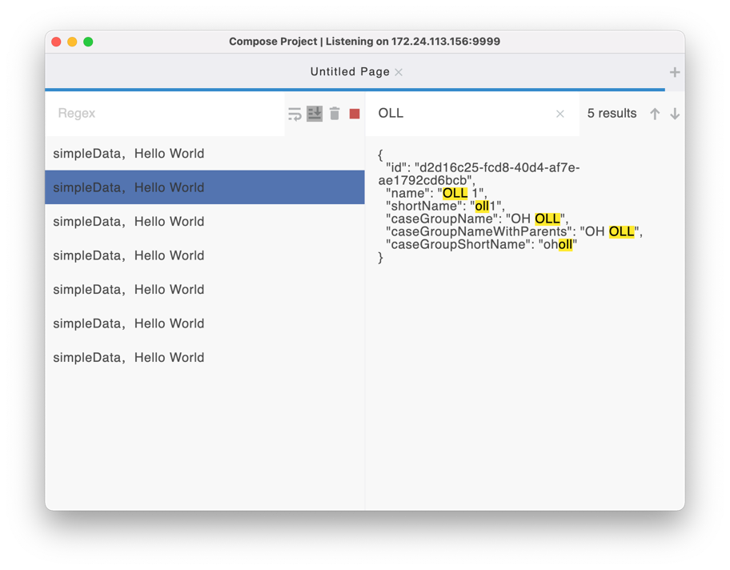
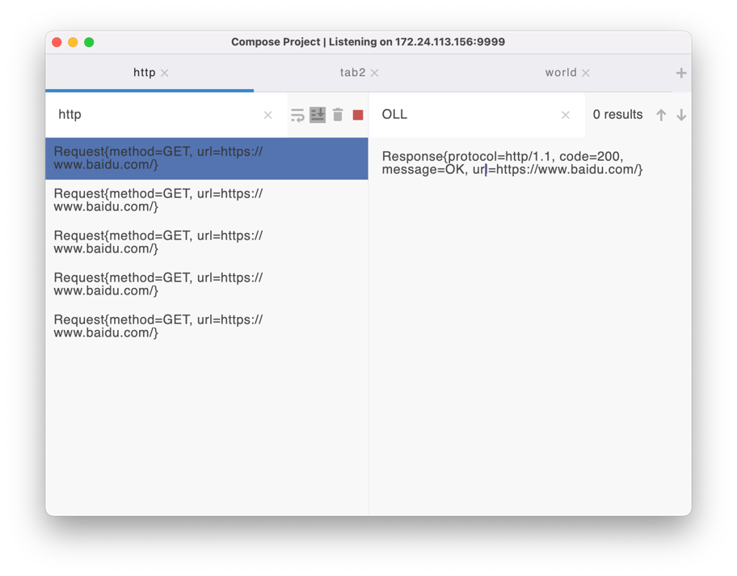
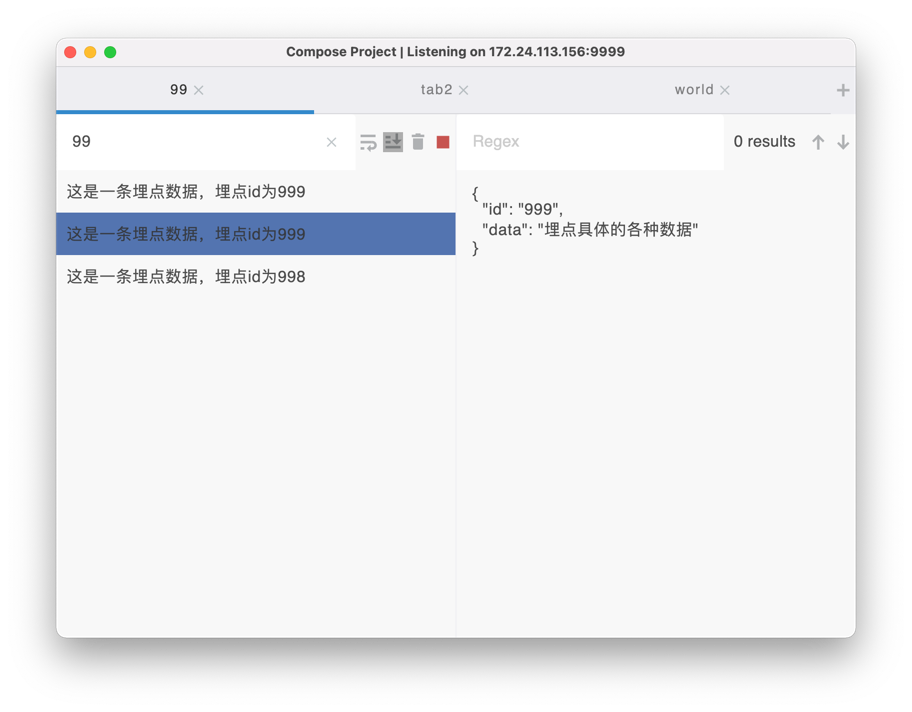
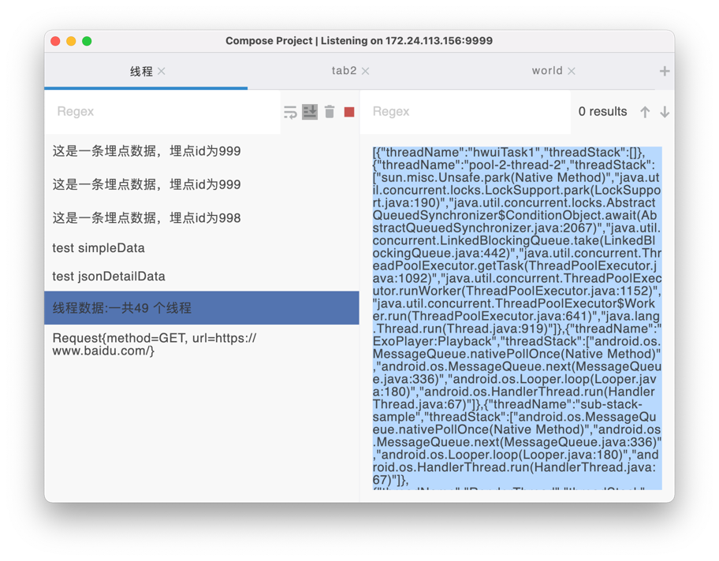

# Compose Project
一个桌面小工具，提高日常工作效率。




# 背景介绍
日常开发中，会经常需要对网络数据进行抓包，以验证服务端数据是否正常。

常规操作：使用Fiddler或者Charles，其实大部分功能我们是不需要用到的。并且使用过程中可能会遇到不同的问题，比如得进行各种配置，安装证书等操作。

优化操作：使用本工具，使用简单，关注所需要的数据。可节省一些时间，提高工作效率。

# 功能
* 多平台，支持windows、mac
* 接收任意形式数据的显示
* 支持过滤搜索，支持正则表达式
* 支持高亮搜索词，定位到指定位置
* 支持多Tab显示
* 支持主题切换
* 支持切换服务端口

# 数据的生产与消费
这个工具本质上就是数据的消费者，只负责显示数据。

数据的生产者，由使用方产生，按照规定的格式，生成数据，发送到PC端进行显示。

所以理论上，可以支持任意形式数据的展示。

# 使用场景
讲解的例子，主要从Android开发的角度进行实现，不管什么实现方式，只要能拿到想要的数据就行了。

### 1.展示网络请求和响应数据
比如可以实用okhttp拦截器的方式,拿到请求和响应数据。（用其他方式也行，没有限制，随便你搞）



### 2.埋点数据
这就看各自App的实现了，有的用第三方埋点SDK，有的是用自研SDK。<br>
但是不管哪种方式，理论上都可以拿到每一次埋点发送的数据，然后发送到PC端进行显示即可。


### 3.调试相关的Log

比如Android开发。
1. 日志太长，Android Studio显示不全。
2. 多手机设备需要连接电脑，不太方便。
3. 端内Web调试日志打印。
4. 比如在搞线程优化，那就经常需要打印当前的所有线程数据，在Logcat里面看不太方便，可以先发到工具，再进行格式化显示，等等。

<br>类似等场景，都可以将数据发送给工具进行显示，可以比较方便的展示数据。



# 如何接入
## 发送数据

请求URL：ip地址+端口</br>
请求方式：POST<br>
请求参数：<br>

| 参数名          | 必选  |类型 | 说明                                            |
|--------------|-----|-----|-----------------------------------------------|
| simpleData   | 是 | String| 左侧列表显示的数据。字符串类型，完全由使用方自定义。                    |
| detailData   | 是 | String| 右侧显示的详细数据。字符串类型，如果是个json字符串的话，会进行格式化显示        |


响应结果
```
{
    "code": 0,
    "message": "success"
}
```


